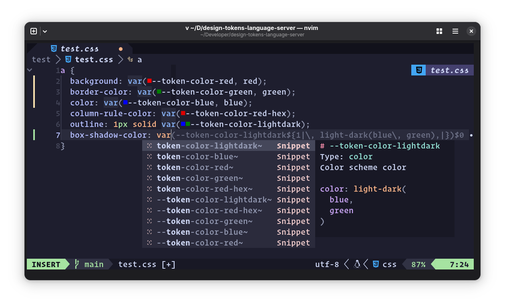
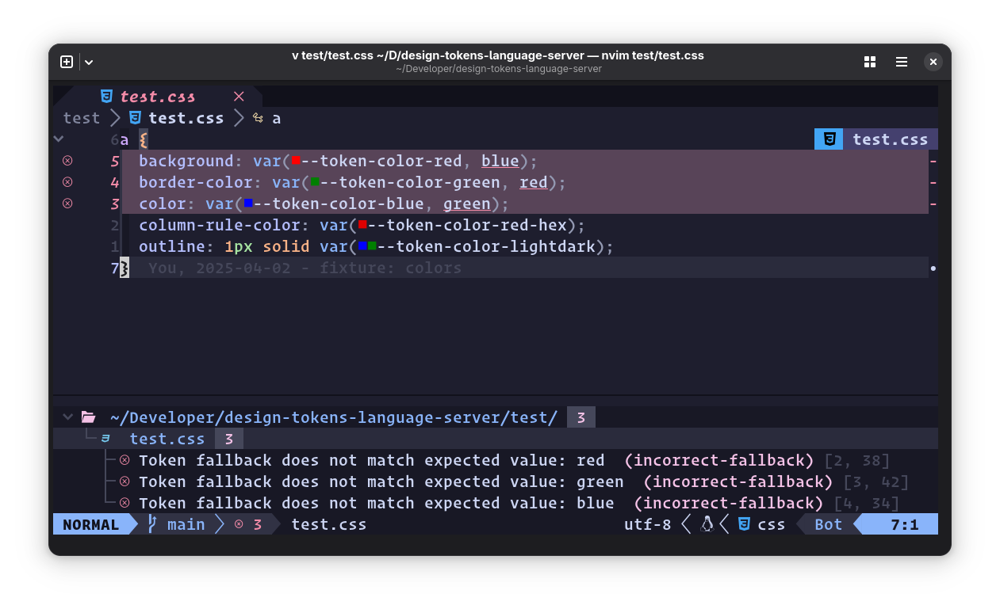
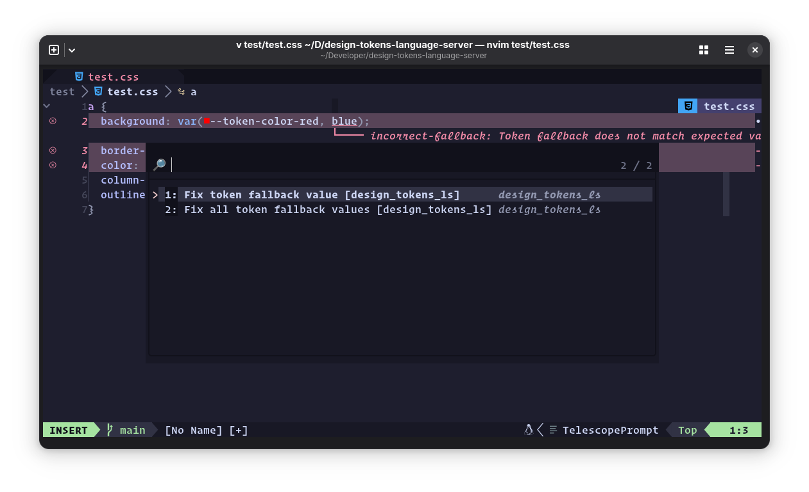
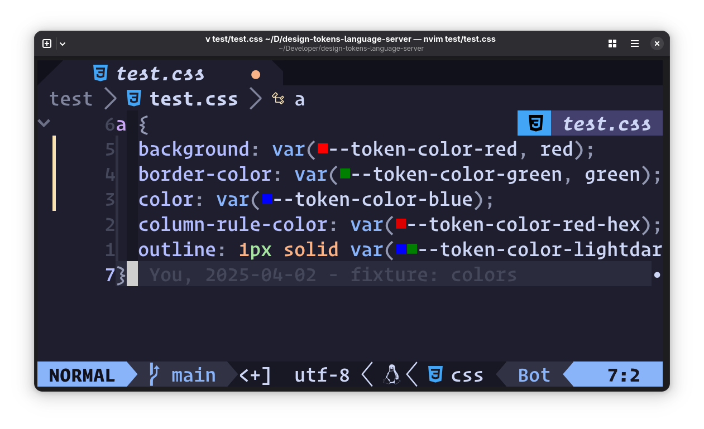
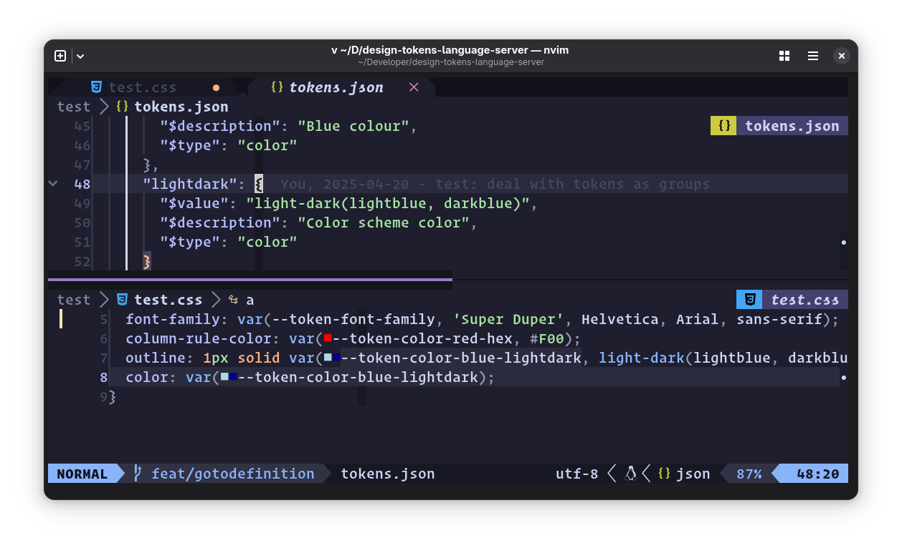

# 🎨 Design Tokens Language Server 🪙

[](https://github.com/bennypowers/design-tokens-language-server/actions/workflows/build.yaml)
[](https://codecov.io/gh/bennypowers/design-tokens-language-server)

Editor tools for working with [design tokens][dtcg] in CSS files.

> [!NOTE]
> This pre-release software. Features may be buggy or incomplete. Before 
> relying on this software, consider contacting the developers to contribute
> features, tests, etc.

## ✨ Features

### ⛸️ Hover Docs

Display markdown-formatter token description and value


### ✂️ Snippets
Auto complete for design tokens - get code snippets for token values with 
optional fallbacks.



### 🥼 Diagnostics

DTLS complains when your stylesheet contains a `var()` call for a design token, 
but the fallback value doesn't match the token's pre-defined `$value`.



### 🦸 Code actions

Toggle the presence of a token `var()` call's fallback value. Offers to fix 
wrong token definitions in Diagnostics.




### 🎨 Document Color
Display token color values in your source, e.g. as swatches



### 🗺️ Go to Definition

Jump to the position in the tokens file where the token is defined.



Go to definition in a split window using Neovim's [`<C-w C-]>`
binding](https://neovim.io/doc/user/windows.html#CTRL-W_g_CTRL-%5D),
which defers to LSP methods when they're available

## 🧰 Usage

Download the latest release for your platform and place the binary in your
`$PATH`, renaming it to `design-tokens-language-server`.

#### Neovim

```lua
---@type vim.lsp.ClientConfig
return {
  cmd = { 'design-tokens-language-server' },
  root_markers = { 'package.json', '.git' },
  filetypes = { 'css' },
}
```

#### VSCode

Install from the [vscode marketplace](https://marketplace.visualstudio.com/items?itemName=pwrs.design-tokens-language-server-vscode). 

#### Other editors

You can also build development extensions for vscodium/vscode and Zed. See
[`deno.json`](tree/main/deno.json) for more info.

## ⚙️ Configuration

You can configure the language server globally on on a per-project basis. Per-project
configuration is done via a `designTokensLanguageServer` block in your project's
`package.json`.

> [!NOTE]
> If you have better ideas on how to source token files in a given
> project, Please open an issue with your suggestions.

Add a `designTokensLanguageServer` block to your project's `package.json`, with
references to tokens files. Entries under `tokensFiles` can be either a string
or an object with `path` and `prefix` properties. The `path` property can be a
relative path or a deno-style npm specifier.

```json
"designTokensLanguageServer": {
  "prefix": "my-ds",
  "tokensFiles": [
     "npm:/@my-design-system/tokens/tokens.json",
    {
      "path": "npm:/@his-design-system/tokens/tokens.json",
      "prefix": "his-ds",
      "groupMarkers": ["GROUP"]
    },
    {
      "path": "./docs/docs-site-tokens.json",
      "prefix": "docs-site"
    }
  ]
},
```

#### Global configuration

You can set up global configuration in your editor's LSP settings for DTLS.

For example, in your lsp config for neovim:

```lua
return {
  cmd = { 'design-tokens-language-server' },
  root_markers = { 'package.json', '.git' },
  filetypes = { 'css' },
  settings = {
    dtls = {
      tokensFiles = {
        {
          path = "~/path/to/tokens.json",
          prefix = "my-ds",
        },
      }
    }
  }
}
```

#### Token Prefixes

The DTCG format does not require a prefix for tokens, but it is recommended to
use a prefix to avoid conflicts with other design systems.
if your token files do not nest all of their tokens under a common prefix,
you can pass one yourself in the `prefix` property of the token file object.

#### Group Markers

Because the DTCG format is nested, a conflict can emerge when the token file
author wants to define a group of tokens, but have the group name also be a
token. For example, `--token-color-red` and `--token-color-red-darker` are both
valid tokens, but unless the author manually prefixes each token in the `red`
group with `red-`, it would not be possible to define a token called
`--token-color-red`.

Design Tokens Language Server therefore has a concept of "group markers" to
contain the token data for a group. The group marker is a well-known token name
that is used to represent the group's top-most token.

The default group markers are `_`, `@`, and `DEFAULT`, because those are
examples mentioned in the various issues on DTCG and style-dictionary which
address the problem of tokens which are also groups.

If you include the `groupMarkers` property (either project-wide or for a
specific token file), then tokens with the same name as any of the group markers
will be treated as a group, and that tokens's data will be used for the group
name, minus the group marker.

For example, if you have a token file with the following tokens:

```json
{
  "color": {
    "red": {
      "GROUP": {
        "$value": "#FF0000",
        "$description": "Red color"
        "darker": {
          "$value": "#AA0000",
          "$description": "Darker red color"
        }
      }
    },
  }
}
```

Then, set the `groupMarkers` property to `["GROUP"]` in your `package.json` for
that particular token file, or globally for all token files

```json
"designTokensLanguageServer": {
  "prefix": "my-ds",
  "groupMarkers": ["GROUP"],
},
```

## 🤝 Contributing

### 🏗️ Building

> [!WARNING]
> DTLS is developed on Linux, works on macOS, but might not work on Windows.
> If you need Windows support, please [open an issue](./issues/new).

Install [Deno](https://deno.land) and clone this repo. Run this task to build
and install the binary to `~/.local/bin/design-tokens-language-server`:

```sh
deno task install
```

Read the logs at `~/.local/state/design-tokens-language-server/dtls.log`.

```sh
tail -f ~/.local/state/design-tokens-language-server/dtls.log
```

[dtcg]: https://tr.designtokens.org/format/
