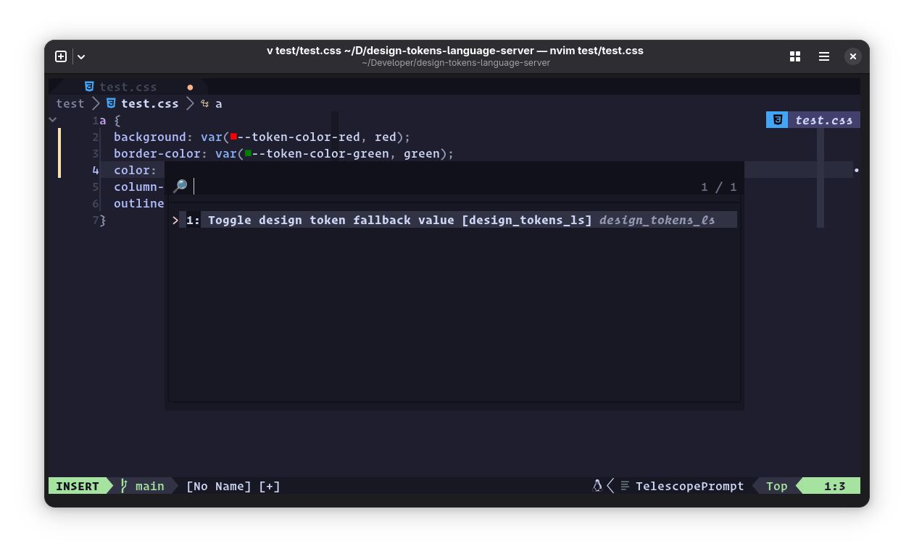
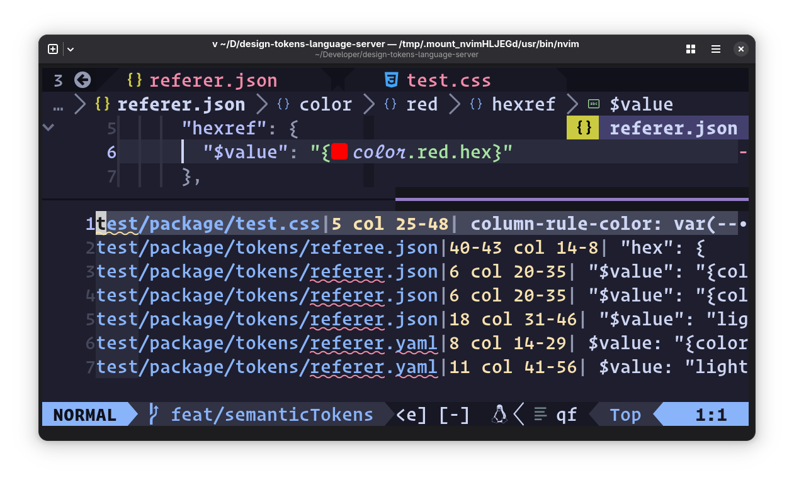

# 🎨 Design Tokens Language Server 🪙

[![build][build]][buildyaml]
[![coverage][coverage]][coveragereport]

Editor tools for working with <abbr title="design tokens community
  group">[DTCG][dtcg]</abbr> formatted design tokens in CSS, and
for token definitions in JSON or YAML files.

> [!NOTE]
> This pre-release software. If you encounter bugs or unexpected behavior,
> please file a detailed [issue][issue].

## ✨ Features

### ⛸️ Hover Docs

Display markdown-formatted token descriptions and value when hovering over token
names.


### ✂️ Snippets

Auto complete for design tokens - get code snippets for token values with
optional fallbacks.


### 🥼 Diagnostics

DTLS complains when your stylesheet contains a `var()` call for a design token,
but the fallback value doesn't match the token's pre-defined `$value`.


### 🦸 Code actions

Toggle the presence of a token `var()` call's fallback value. Offers to fix
wrong token definitions in Diagnostics.




### 🎨 Document Color

Display token color values in your source, e.g. as swatches.


### 👂 Semantic Tokens

Highlight token references inside token definition files.


### 🪪 Go to Definition

Jump to the position in the tokens file where the token is defined. Can also
jump from a token reference in a JSON file to the token's definition.


Go to definition in a split window using Neovim's [`<C-w C-]>` binding][cwcdash],
which defers to LSP methods when they're available.

### 🗺️ References

Locate all references to a token in open files, whether in CSS or in the token
definition JSON or YAML files



## 🧰 Usage

Download the latest release for your platform and place the binary in your
`$PATH`, renaming it to `design-tokens-language-server`.

### 🛻 Installation

#### Neovim

Using native Neovim LSP (see [`:help lsp`][neovimlspdocs] for more
info):

Create a file like `~/.config/nvim/lsp/design_tokens_ls.lua`:

```lua
---@type vim.lsp.ClientConfig
return {
  cmd = { 'design-tokens-language-server' },
  root_markers = { 'package.json', '.git' },
  filetypes = { 'css', 'json', 'yaml' },
  settings = {
    dtls = {
      -- Optional: configure global token files
      tokensFiles = {
        {
          path = "~/path/to/tokens.json",
          prefix = "my-ds",
        },
      },
      -- Optional: configure group markers
      groupMarkers = { '_', '@', 'DEFAULT' },
    }
  },
  -- Optional: enable document color support
  on_attach = function(client, bufnr)
    if vim.lsp.document_color then
      vim.lsp.document_color.enable(true, bufnr, {
        style = 'virtual'
      })
    end
  end,
}
```

Then configure your LSP setup to load configs from `~/.config/nvim/lsp/`. This allows
you to manage each language server in its own file. See the
[neovim docs][neovimlspdocs] for details on setting up native LSP clients.

#### VS Code

Install from the [VS Code Marketplace][vscodemarketplace].

The extension includes the language server binary, so no additional installation is
required.

#### Zed

Install from the [Zed Extensions][zedextensions] page, or search for
"Design Tokens" in Zed's extension panel.

## ⚙️ Configuration

In order to use DTLS, you need to first configure it to know where to find your
design tokens, and you can also provide it with options for how to deal with
them.

### 🪙 Token files

Design Tokens Language Server uses the
[DTCG](https://tr.designtokens.org/format/) format for design tokens. If you
have a design token file in a different format, you can use
[style-dictionary](https://styledictionary.com/info/dtcg/) to convert it to
DTCG.

You can configure the language server globally on on a per-project basis.
Per-project configuration is done via a `designTokensLanguageServer` block in
your project's `package.json`.

> [!NOTE]
> If you have better ideas on how to source token files in a given project,
> Please open an issue with your suggestions.

Add a `designTokensLanguageServer` block to your project's `package.json`, with
references to tokens files. Entries under `tokensFiles` can be either a string
or an object with `path` and `prefix` properties. The `path` property can be a
relative path or a deno-style npm specifier.

```json
{
  "name": "@my-design-system/elements",
  "designTokensLanguageServer": {
    "prefix": "my-ds",
    "tokensFiles": [
      "npm:@my-design-system/tokens/tokens.json",
      {
        "path": "npm:@his-design-system/tokens/tokens.json",
        "prefix": "his-ds",
        "groupMarkers": ["GROUP"]
      },
      {
        "path": "./docs/docs-site-tokens.json",
        "prefix": "docs-site"
      },
      {
        "path": "~/secret-projects/fanciest-tokens.json",
        "prefix": "shh"
      }
    ]
  }
}
```

### Global configuration

You can set up global configuration in your editor's LSP settings for DTLS. This
configuration will be used as fallbacks for all projects. There's no need to set
them if your project already has a `designTokensLanguageServer` block in its
`package.json`.

For example, in your lsp config for neovim:

```lua
return {
  cmd = { 'design-tokens-language-server' },
  root_markers = { 'package.json', '.git' },
  filetypes = { 'css' },
  settings = {
    dtls = {
      tokensFiles = {
        {
          path = "~/path/to/tokens.json",
          prefix = "my-ds",
        },
      }
    }
  }
}
```

### Token Prefixes

The DTCG format does not require a prefix for tokens, but it is recommended to
use a prefix to avoid conflicts with other design systems. if your token files
do not nest all of their tokens under a common prefix, you can pass one yourself
in the `prefix` property of the token file object.

### Group Markers

Because the DTCG format is nested, a conflict can emerge when the token file
author wants to define a group of tokens, but have the group name also be a
token. For example, `--token-color-red` and `--token-color-red-darker` are both
valid tokens, but unless the author manually prefixes each token in the `red`
group with `red-`, it would not be possible to define a token called
`--token-color-red`.

Design Tokens Language Server therefore has a concept of "group markers" to
contain the token data for a group. The group marker is a well-known token name
that is used to represent the group's top-most token.

The default group markers are `_`, `@`, and `DEFAULT`, because those are
examples mentioned in the various issues on DTCG and style-dictionary which
address the problem of tokens which are also groups.

If you include the `groupMarkers` property (either project-wide or for a
specific token file), then tokens with the same name as any of the group markers
will be treated as a group, and that tokens's data will be used for the group
name, minus the group marker.

For example, if you have a token file with the following tokens:

```json
{
  "color": {
    "red": {
      "GROUP": {
        "$value": "#FF0000",
        "$description": "Red color",
        "darker": {
          "$value": "#AA0000",
          "$description": "Darker red color"
        }
      }
    }
  }
}
```

Then, set the `groupMarkers` property to `["GROUP"]` in your `package.json` for
that particular token file, or globally for all token files in your editor
settings.

```json
"designTokensLanguageServer": {
  "prefix": "my-ds",
  "groupMarkers": ["GROUP"],
},
```

## 🤝 Contributing

See [CONTRIBUTING.md][contributingmd]

[build]:     https://github.com/bennypowers/design-tokens-language-server/actions/workflows/build.yaml/badge.svg
[buildyaml]: https://github.com/bennypowers/design-tokens-language-server/actions/workflows/build.yaml
[coverage]: https://codecov.io/gh/bennypowers/design-tokens-language-server/graph/badge.svg?token=9VOMFXI5GQ
[coveragereport]: https://codecov.io/gh/bennypowers/design-tokens-language-server/
[dtcg]: https://www.designtokens.org/
[contributingmd]: ./CONTRIBUTING.md
[issue]: https://github.com/bennypowers/design-tokens-language-server/issues/new/
[zedextensions]: https://zed.dev/extensions/design-tokens
[vscodemarketplace]: https://marketplace.visualstudio.com/items?itemName=pwrs.design-tokens-language-server-vscode
[neovimlspdocs]: https://neovim.io/doc/user/lsp.html
[cwcdash]: https://neovim.io/doc/user/windows.html#CTRL-W_g_CTRL-%5D
