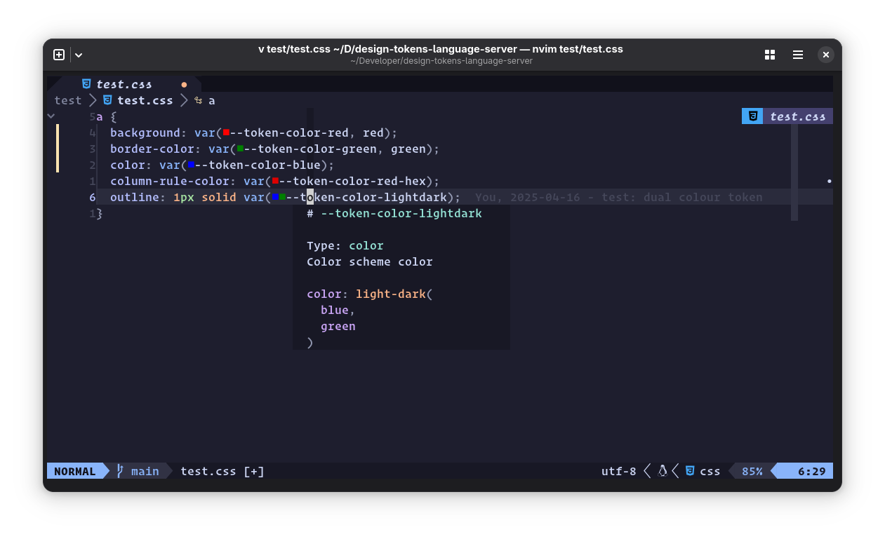

# 🎨 Design Tokens Language Server 🪙

Editor tools for working with [design tokens][dtcg] in CSS files.

> [!Info]
> This is extremely early software. Features may be buggy or incomplete. Before 
> relying on this software, consider contacting the developers to contribute
> features, tests, etc.

## Features

### Hover

Display markdown-formatter token description and value



### Completions
Auto complete for design tokens - get code snippets for token values with 
optional fallbacks.


### Diagnostics

DTLS complains when your stylesheet contains a `var()` call for a design token, 
but the fallback value doesn't match the token's pre-defined `$value`.


### Code actions

Toggle the presence of a token `var()` call's fallback value. Offers to fix 
wrong token definitions in Diagnostics.


### Document Color
Display token color values in your source, e.g. as swatches


## Building

> [!WARNING]
> This is being developed on Linux, might work with MacOS, and probably won't 
> yet work on windows

Install Deno and clone this repo

```sh
deno task install
```

### Usage

Download the latest release for your platform and place the binary in your
`$PATH`, renaming it to `design-tokens-language-server`.

### Neovim

```lua
---@type vim.lsp.ClientConfig
return {
  cmd = { 'design-tokens-language-server' },
  root_markers = { '.git' },
  filetypes = { 'css' },
}
```

You can also build development extensions for vscodium/vscode and Zed. See
[`deno.json`](tree/main/deno.json) for more info.

### Configure your project

The language server currently depends on a package.json field to read design 
token files. If you have better ideas on how to source token files in a given
project, Please open an issue with your suggestions.

Add a `designTokensLanguageServer` block to your project's `package.json`, 
pointing to [dtcg][dtcg] format design tokens, and including an optional prefix:

```json
"designTokensLanguageServer": {
  "tokensFiles": [
    {
      "prefix": "token",
      "path": "./node_modules/@mydesign/system/tokens.json"
    }
  ]
},
```

[dtcg]: https://tr.designtokens.org/format/
